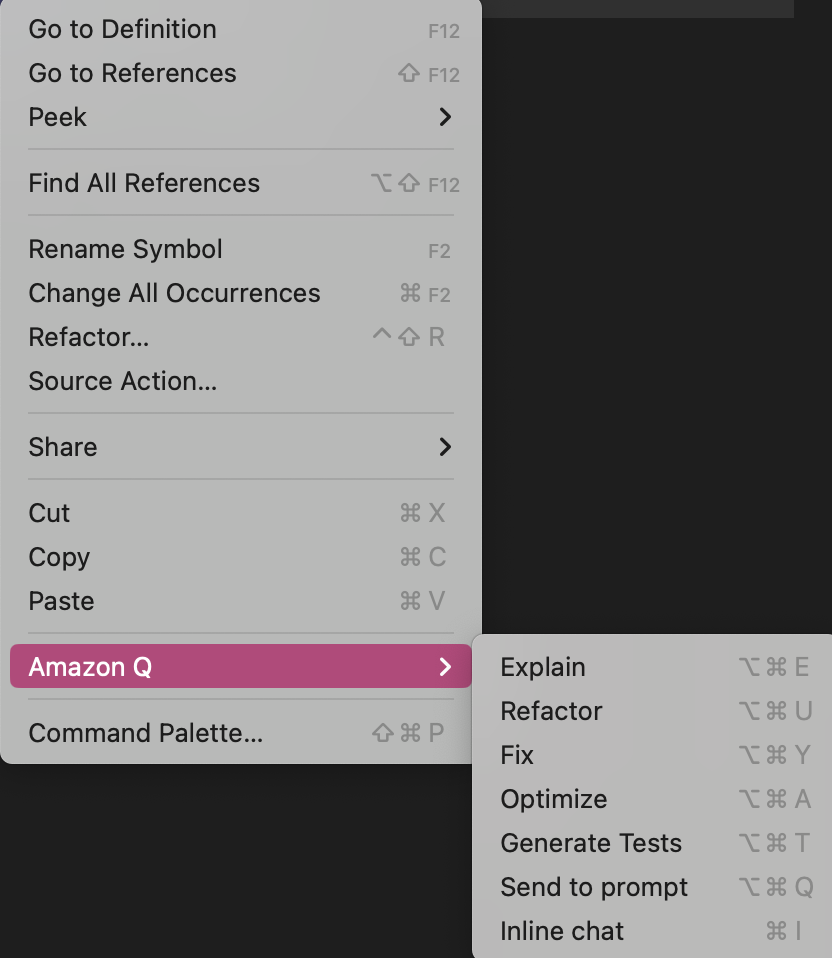
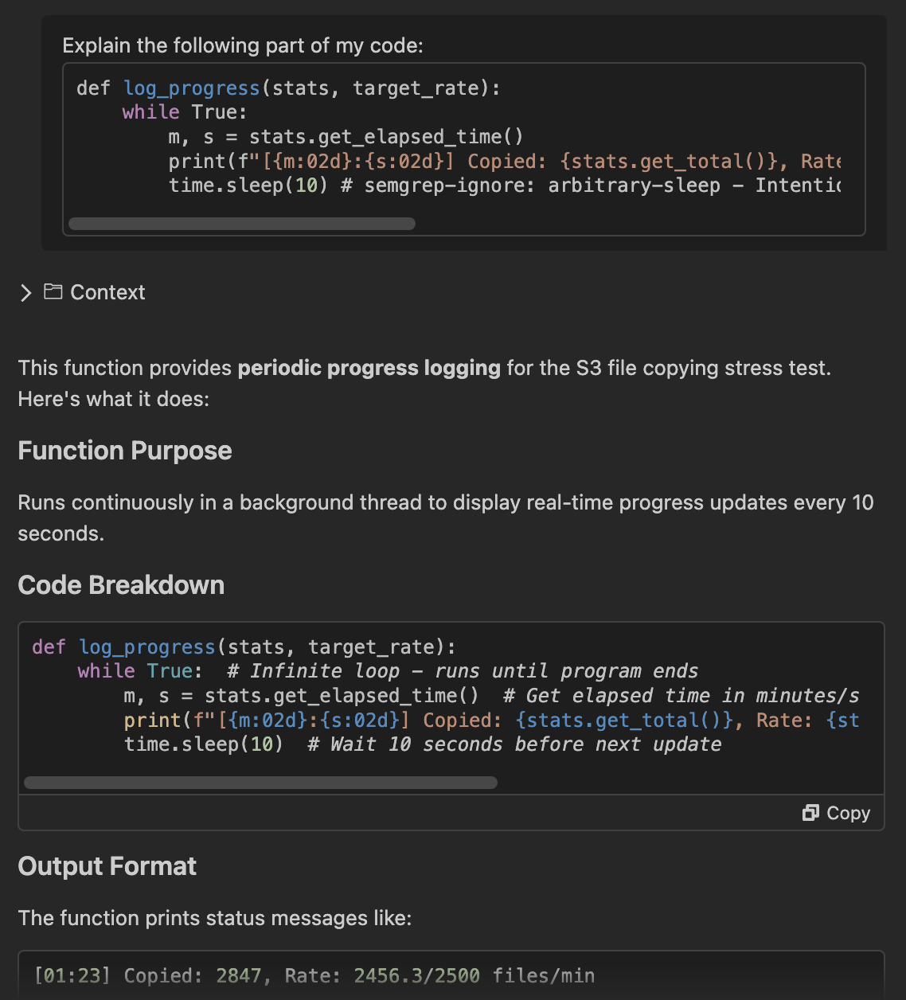
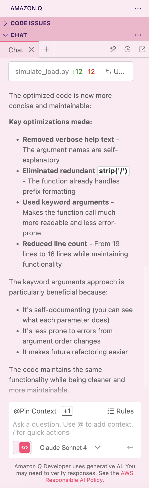
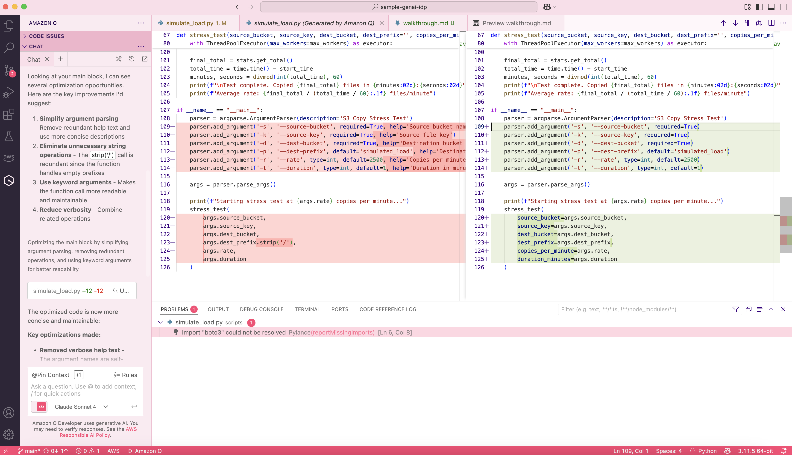
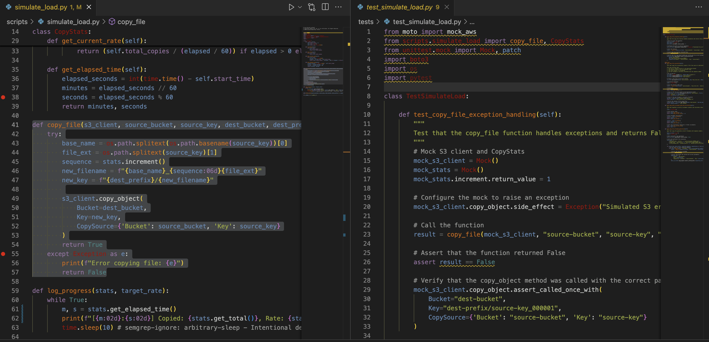
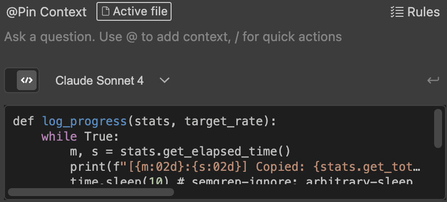
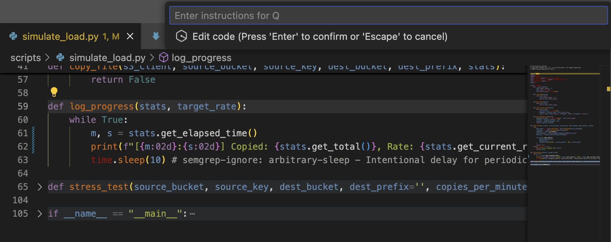
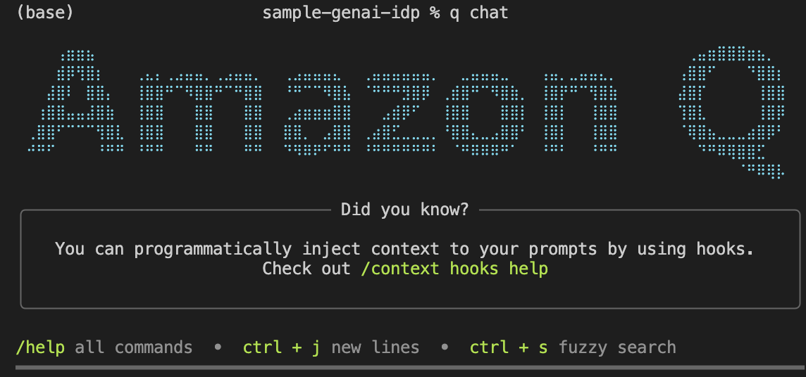
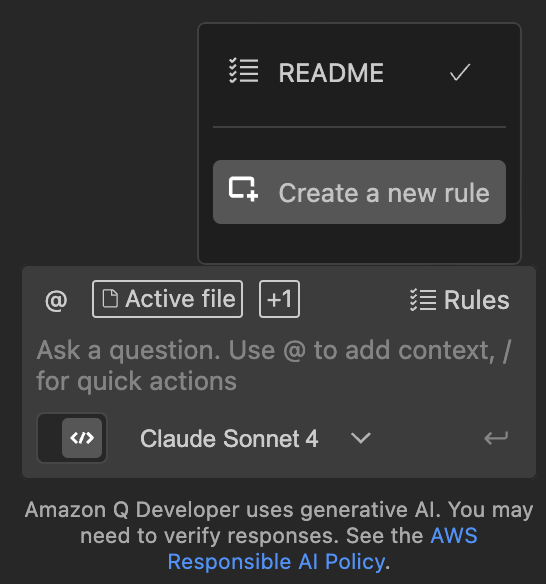

# Walkthrough

> *Note: The following reference screenshots were taken on a Macbook Pro Apple M2 Max, running macOS Sonomoa 14.6.1 and Visual Studio Code 1.100.3. Shortcuts, file directories, and other machine-specific characteristics may look different in your environment than what is pictured or listed here.*

## Amazon Q Chatbox Functions

The following functions of Amazon Q are designed to help maximize efficiency while drafting code. Right-clicking text within the code window will allow you to select from the following options:



* **Explain**

    This is a relatively self-explanatory feature: highlighting specific code and selecting "Explain" will have Q's chatbox appear and explain in detail the purpose, output, and context of the selected code.

    For example, highlighting and asking Q to explain the following code:

    ```
    def log_progress(stats, target_rate):
        while True:
            m, s = stats.get_elapsed_time()
            print(f"[{m:02d}:{s:02d}] Copied: {stats.get_total()}, Rate: {stats.get_current_rate():.1f}/{target_rate} files/min")
            time.sleep(10) # semgrep-ignore: arbitrary-sleep - Intentional delay for periodic logging. Duration is hardcoded and not user-controlled.
    ```
    ...will have Q return the following in response in the chat window:
    
    
    
    The assistant will continue with its thorough breakdown of the function.

* **Fix**, **Optimize**, and **Refactor:**

    These three functions tend to have fairly overlapping practical applications, and can often produce the same or similar results in terms of addressing variable redundancy, speed, and output concision of whatever function or code block has been selected.

    Asking Q to fix, reformat, or optimize your code using the chat box will have it return something along the lines of:

    

    A split window will then allow you to visually see the changes made, and choose whether to accept or reject them.

    


* **Generate Tests:**

    Using the assistant to generate a test for a function will have Q create a separate code file and generate tests to assess the purpose and intended goal of the selected function. For example, take the following function:

    ```
    def copy_file(s3_client, source_bucket, source_key, dest_bucket, dest_prefix, stats):
        try:
            base_name = os.path.splitext(os.path.basename(source_key))[0]
            file_ext = os.path.splitext(source_key)[1]
            sequence = stats.increment()
            new_filename = f"{base_name}_{sequence:06d}{file_ext}"
            new_key = f"{dest_prefix}/{new_filename}"
        
            s3_client.copy_object(
                Bucket=dest_bucket,
                Key=new_key,
                CopySource={'Bucket': source_bucket, 'Key': source_key}
            )
            return True
        except Exception as e:
            print(f"Error copying file: {e}")
            return False
    ```

    Right clicking the highlighted function and choosing "generate test" will generate the following unit tests:

    
* **Send to Prompt:**

    Highlighted text will be sent into the chat window's text box, where additional questions or context can be added using Amazon Q.

    For example, if the function we previously used, def log_progress, were to be sent to prompt, it would look like this:

    
* **Inline Chat:**

    Selecting inline chat will simply open the inline chat window, where in a similar fashion as "Send to Prompt," one can add additional context or ask for feedback from Q about the selected code.

    

    More information about using inline chat can be found on the [Amazon Q Developer user guide.](https://docs.aws.amazon.com/amazonq/latest/qdeveloper-ug/q-in-IDE-inline-chat.html)
## Amazon Q CLI

The following functions of Amazon Q pertain to usage within the command line interface (CLI).

* **Activating Q:**

    In order to begin a chat with Q in the command line, use the function
    > q chat
    
    in the terminal.
    
    This will allow conversation with Q within the terminal, like so:

     

## Amazon Q Rules Files

To establish rules for Amazon Q to follow, there are a few options to select from.

1. **From within the chatbox:**

    Open the assistant chatbox window and click on the "Rules" button in the upper right corner of the text box.
    
    

    Select "Create a new rule" and title your rule.

    From there, you can edit your rule using the generated markdown file found in the projects [Your Project Root]/.amazonq/rules folder.

2. **Directly from a markdown file:**

    Create a folder titled [Your Project Root]/.amazonq/rules and within that folder, create a markdown file and title it how you please. Add your (detailed) rules within that markdown file and save.

Amazon Q will use these files as context from here on out when generating or optimizing code.

For more information, see the [documentation in the Amazon Q Developer user guide.](https://docs.aws.amazon.com/amazonq/latest/qdeveloper-ug/context-project-rules.html)

## Important to Note:

There are a few small considerations to keep in mind when using Q.

1. Be sure to highlight *all* of the text that is pertinent to your question or your goals. Amazon Q requires as much context as possible, and while it is possible to continue to add context through the chat box after the fact, it is much easier to simply include all the necessary context Q will require from the beginning.

    For example, highlighting the name of a function or the first line is *not* enough information for Q to help optimize, generate a unit test for, or refactor the whole function. It will not understand it is for the whole function, and instead only address the single highlighted line.

2. When adding context or outlining rules, be sure to be extremely explicit and detailed in what is expected of the assistant. Ambiguities can cause issues, as the LLM will fill in any gaps itself, and it may cause issues if it fills it in incorrectly.

3. Be sure to vet any output by the LLM before implementing what it has offered.